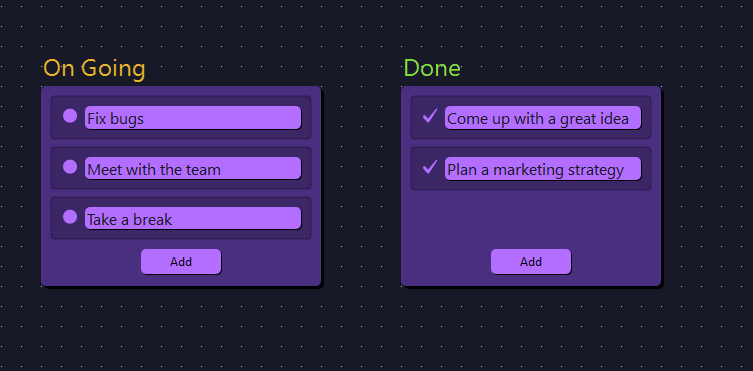
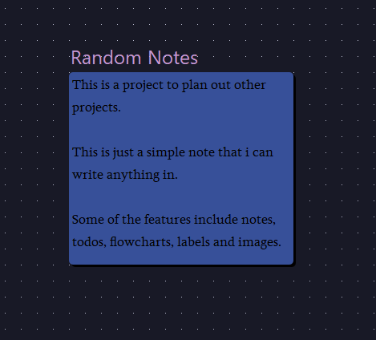
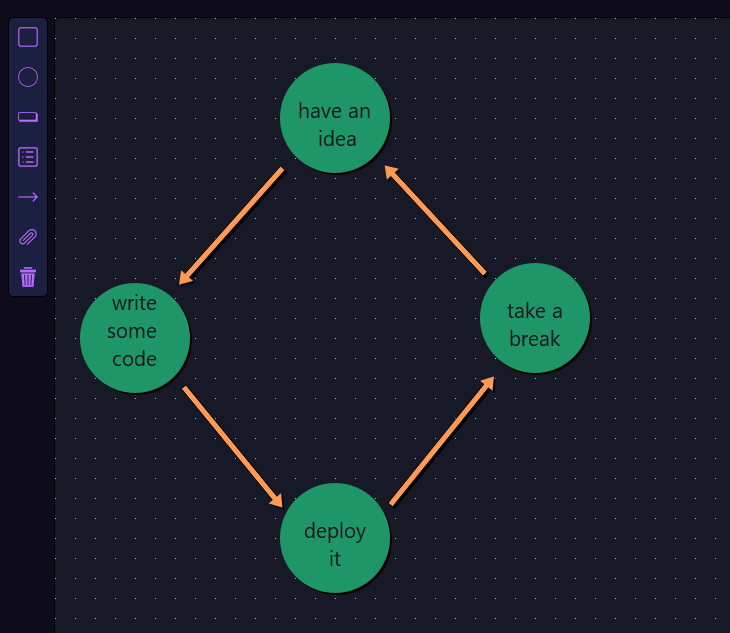
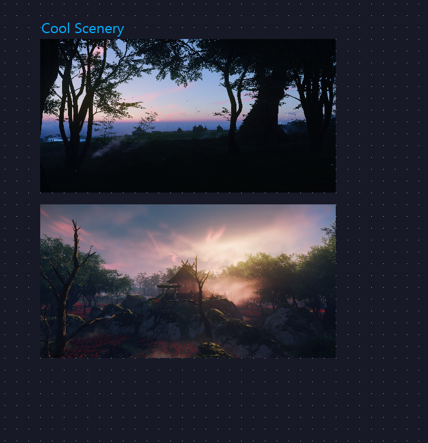

# Personal Organizer Project

This project is a tool to help people organize and execute on their own projects.

Some of the features include to-do lists, labels, notes, flowcharts and mood boards.

To use download the build folder of the required platform and run the executable.

## Example1

## Example2

## Example3

## Example4

